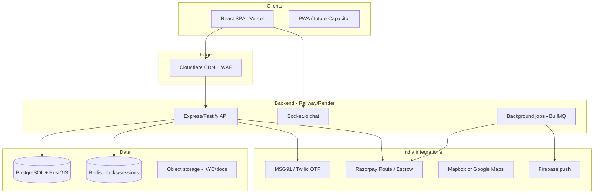

# TurfMate — Production Launch Roadmap (Option C)

**Target:** Full B2B2C launch — real users, real payments, multi-turf, Virar → Mumbai expansion  
**Timeline:** ~16–20 weeks (4–5 months) with a small team  
**Current state:** Production-ready UI demo; data mostly in `localStorage`; optional Node/SQLite API stub

---

## 1. Target architecture



**Domains (example):**

| Service | URL |
|---------|-----|
| Player / Owner web app | `https://app.turfmate.in` |
| API + WebSocket | `https://api.turfmate.in` |
| Admin (same SPA, role-gated) | `https://app.turfmate.in` → `super_admin` |

---

## 2. Vendor stack (India)

| Need | Recommended | Alternatives |
|------|-------------|--------------|
| Frontend hosting | **Vercel** or Cloudflare Pages | Netlify |
| API hosting | **Railway** or Render | AWS ECS, DigitalOcean |
| Database | **Supabase Postgres + PostGIS** or Neon | RDS, self-hosted |
| Cache / locks | **Upstash Redis** | Redis Cloud |
| OTP | **MSG91** | Twilio, Firebase Auth |
| Payments + split | **Razorpay** (Payment Links + Route for payouts) | Cashfree |
| KYC docs | **S3** / Cloudflare R2 | Supabase Storage |
| Maps | **Mapbox** (cost) or OSM + Leaflet (current) | Google Maps Platform |
| Push | **Firebase Cloud Messaging** | OneSignal |
| Email | **Resend** / AWS SES | SendGrid |
| Monitoring | **Sentry** + Better Stack uptime | Datadog |
| Analytics | **PostHog** (self-host or cloud) | GA4 |
| Error / support | **Crisp** or Intercom | — |

**Rough monthly infra (pilot → scale):** ₹3k–8k pilot → ₹25k–60k at 10k MAU (excluding payment MDR).

---

## 3. Phased delivery

### Phase 0 — Foundation (Weeks 1–2) ✅ repo ready — [deploy guide](./Phase-0-Deploy.md)

| Task | Owner | Status |
|------|-------|--------|
| Git repo + CI | Eng | ✅ CI workflow; run `git init` + push (see Phase-0-Deploy) |
| Env config | Eng | ✅ `.env.example`, `src/config/env.js` |
| Deploy demo SPA | Eng | ⏳ Connect repo to **Vercel** (config in `vercel.json`) |
| Deploy API stub | Eng | ⏳ Connect repo to **Railway** (`railway.toml`, `/health`) |
| DNS + SSL | DevOps | ⏳ Optional: `app` + `api` subdomains |

---

### Phase 1 — Backend & data model (Weeks 3–6)

| Epic | Work |
|------|------|
| E1–E2 | Real auth: OTP send/verify API, JWT sessions, profile CRUD |
| E3 | Turfs/slots from Postgres; PostGIS `ST_DWithin` for radius |
| E4–E5 | Bookings, slot locks (Redis TTL 5 min), split escrow state machine |
| E12–E15 | Owner KYC records, admin approval API |

**Exit criteria:**

- [ ] New user completes OTP onboarding → profile in DB  
- [ ] Two browsers cannot double-book same slot  
- [ ] Split state persisted server-side (not `localStorage`)  
- [ ] Schema matches `Epics/Database Schema .md` (migrate from SQLite prototype)

**Team:** 1 backend, 1 frontend (wire `useAppState` → API layer).

---

### Phase 2 — Payments & trust (Weeks 7–10)

| Epic | Work |
|------|------|
| E4–E5 | Razorpay orders, webhooks, refund on split fail/cancel |
| E5 | Escrow ledger: collected / pending / owner payout / 10% commission |
| E12 | Owner bank verification (penny drop or Razorpay Route linked account) |
| Legal | Terms, Privacy, Refund policy, GST invoicing on platform fee |

**Exit criteria:**

- [ ] Test payment end-to-end in Razorpay test mode  
- [ ] Webhook idempotency + signature verification  
- [ ] Auto-refund when split expires (server cron, not client)  
- [ ] Owner sees net payout in dashboard from real transactions  

---

### Phase 3 — Real-time & social (Weeks 11–13)

| Epic | Work |
|------|------|
| E6–E7 | Locker feed + chat from API; Socket.io rooms persisted |
| E8–E9 | Friend requests, squads in DB |
| E10–E11 | Score → leaderboard sync server-side |
| E14 | Owner broadcasts with `expiresAt` enforced server-side |

**Exit criteria:**

- [ ] User A’s split visible to User B without shared browser  
- [ ] Chat messages sync across two devices  
- [ ] Push notification on split invite (FCM)  

---

### Phase 4 — Pilot launch (Weeks 14–16)

**Geography:** Virar / Vasai — 2–3 partner turfs  

| Workstream | Tasks |
|------------|--------|
| Ops | Onboard 2 owners manually; train on owner dashboard |
| Product | `VITE_DEMO_MODE=false`; remove demo phone shortcuts |
| QA | Run [Demo User Journey](./Demo%20User%20Journey.md) on staging with real OTP + Razorpay test |
| Support | WhatsApp support line, manual dispute playbook (E15) |

**Exit criteria:**

- [ ] 50+ real bookings in 30 days  
- [ ] <2% payment failure rate  
- [ ] No P0 bugs open >48h  

---

### Phase 5 — Production hardening (Weeks 17–20)

| Area | Tasks |
|------|--------|
| Security | Rate limits, WAF, JWT rotation, secrets in vault |
| Performance | API p95 <300ms; bundle split (lazy routes) |
| Mobile | PWA manifest + install prompt; optional Capacitor wrapper |
| Compliance | Data retention, account deletion, KYC doc encryption |
| Scale | Read replicas, connection pooling (PgBouncer) |
| Observability | Sentry, structured logs, on-call runbook |

**Exit criteria:**

- [ ] Load test: 100 concurrent checkout attempts, 0 double-books  
- [ ] Pen test or OWASP top-10 review  
- [ ] App Store / Play listing (if native wrapper)  

---

## 4. Code migration checklist (localStorage → API)

Replace these client-only stores with API + server as source of truth:

| Key / state | API endpoint (to build) |
|-------------|-------------------------|
| `tm_profile` | `POST /auth/verify-otp`, `GET/PATCH /users/me` |
| `tm_bookings` | `GET/POST /bookings`, webhooks update status |
| `tm_announcements` | `GET/POST /feed` (geo filtered) |
| `tm_chats` | `GET /chat/inbox`, Socket `send_message` |
| `tm_friend_requests` | `POST /friends/request`, `POST /friends/accept` |
| `tm_squad_groups` | `POST /squads` |
| `tm_friend_stats` | `POST /games/finalize` |
| Slot locks | Redis + `POST /bookings/lock` (exists in stub) |

**Pattern:** Introduce `src/services/apiClient.js` + React Query (or SWR) per domain; keep `localStorage` as offline cache only after Phase 1.

---

## 5. Environment matrix

### Staging

```
VITE_API_URL=https://api-staging.turfmate.in/api
VITE_SOCKET_URL=https://api-staging.turfmate.in
VITE_DEMO_MODE=false
VITE_RAZORPAY_KEY_ID=rzp_test_...
CORS_ORIGIN=https://staging.turfmate.in
```

### Production

```
VITE_API_URL=https://api.turfmate.in/api
VITE_SOCKET_URL=https://api.turfmate.in
VITE_APP_URL=https://app.turfmate.in
VITE_DEMO_MODE=false
VITE_RAZORPAY_KEY_ID=rzp_live_...
RAZORPAY_KEY_SECRET=*** (server only)
MSG91_AUTH_KEY=*** (server only)
JWT_SECRET=*** (server only)
DATABASE_URL=postgresql://...
```

---

## 6. Team & roles

| Role | FTE | Phases |
|------|-----|--------|
| Full-stack lead | 1 | 0–5 |
| Frontend (React) | 1 | 1–4 |
| Backend (Node/Postgres) | 1 | 1–5 |
| DevOps (part-time) | 0.25 | 0, 5 |
| Product / QA | 0.5 | 4–5 |
| Legal / finance | Ad hoc | 2, 4 |

---

## 7. Risk register

| Risk | Mitigation |
|------|------------|
| Double booking | Redis lock + DB unique constraint on `(turf_id, slot_id, date)` |
| Split payment disputes | Server-side escrow; auto-refund job; admin force-refund (E15) |
| OTP cost / deliverability | MSG91 DLT registered templates; fallback WhatsApp OTP |
| Owner churn | T+1 payouts; transparent commission in dashboard |
| Scope creep | Ship pilot with E1–E7 + payments only; tournaments v2 |

---

## 8. Immediate next steps (this week)

1. **Register domains** — `turfmate.in`, point `app` + `api` subdomains  
2. **Create Vercel project** — connect repo, set env from `.env.example`  
3. **Deploy API** — Railway: root `server/`, `npm start`, set `CORS_ORIGIN`  
4. **Open Razorpay test account** — get test keys for Phase 2  
5. **Open MSG91 account** — DLT template for OTP  
6. **Start Phase 1 sprint** — auth API + Postgres schema migration  

---

## 9. Definition of “live” (Option C)

TurfMate is **production live** when all are true:

- Real `+91` OTP login (no demo shortcuts)  
- Real UPI/card payments with webhook confirmation  
- Bookings and splits shared across all users in DB  
- Owner payouts reconciled with Razorpay Route  
- 2+ turfs live in Virar with signed partner agreements  
- Legal pages published; support channel active  
- Monitoring + backups enabled  

Until then, treat the Vercel URL as a **marketing demo** (`VITE_DEMO_MODE=true`).

---

## Related docs

- [Epics README](./README.md) — feature specs E1–E15  
- [Database Schema .md](./Database%20Schema%20.md) — Postgres target  
- [Demo User Journey](./Demo%20User%20Journey.md) — QA script  
