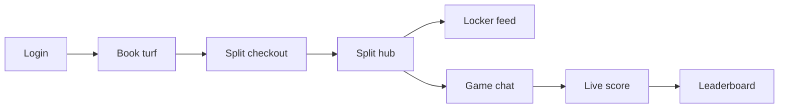

# TurfMate Epics — Master Index

Complete product specification for the TurfMate demo (React SPA, view-based routing via `useAppState.view`).

## Demo credentials

| Role | Phone | OTP |
|------|-------|-----|
| Player | `9876543210` | `1234` |
| Owner | `1111111111` | `1234` |
| Super Admin | `9999999999` | `1234` |

## Epic catalog

| Epic | Title | Primary route(s) | Doc |
|------|-------|------------------|-----|
| E1 | Phone OTP Auth & Session | `splash` → `login` → `otp_verify` | [Epic E1.md](./Epic%20E1.md) |
| E2 | Player Onboarding | `profile_setup` → `location_manual` | [Epic E2.md](./Epic%20E2.md) |
| E3 | Turf Search & Map | `home`, `search_engine`, `play_radius`, `turf_details` | [Epic E3.md](./Epic%20E3.md) |
| E4 | Slot Selection & Checkout | `turf_details` + `CheckoutModal` | [Epic E4.md](./Epic%20E4.md) |
| E5 | Split Booking & Escrow | `split_hub`, `JoinSplitReviewSheet` | [Epic E5.md](./Epic%20E5.md) |
| E6 | Locker Room Feed | `locker_room` | [Epic E6.md](./Epic%20E6.md) |
| E7 | Chat & Messaging | `chat` | [Epic E7.md](./Epic%20E7.md) |
| E8 | Player Radar | `radar` | [Epic E7_8_9.md](./Epic%20E7_8_9.md) |
| E9 | Squads & Friends | `squad`, Chat Requests | [Epic E7_8_9.md](./Epic%20E7_8_9.md) |
| E10 | Live Score Calculator | `score_calculator` | [Epic E10_11.md](./Epic%20E10_11.md) |
| E11 | Leaderboard & Tournaments | `leaderboard`, `tournaments` | [Epic E10_11.md](./Epic%20E10_11.md) |
| E12 | Owner Onboarding & KYC | `owner_business` → `owner_pending` | [Epic E12.md](./Epic%20E12.md) |
| E13 | Owner Slot & Revenue | `owner_dashboard` tabs | [Epic E13.md](./Epic%20E13.md) |
| E14 | Owner Broadcasts | `owner_dashboard` → Broadcast tab | [Epic E14.md](./Epic%20E14.md) |
| E15 | Super Admin Ops | `super_admin` tabs | [Epic E15.md](./Epic%20E15.md) |

**Also:** [Phase 0 Deploy](./Phase-0-Deploy.md) · [Production Roadmap (Option C)](./Production%20Roadmap.md) · [Database Schema .md](./Database%20Schema%20.md) · [Demo User Journey.md](./Demo%20User%20Journey.md)

## Player golden path (demo script)

See [Demo User Journey.md](./Demo%20User%20Journey.md) for step-by-step QA script.

## View map (epic name → app implementation)

Many epics describe separate screens; the SPA uses **modals and tabs** instead:

| Epic reference | Actual implementation |
|----------------|----------------------|
| `booking_bottom_sheet` | Sticky footer on `turf_details` + `CheckoutModal` |
| `checkout_split_setup`, `payment_gateway_mock` | `CheckoutModal` overlay |
| `join_split_review` | `JoinSplitReviewSheet` component |
| `split_success_modal` | `SplitSuccessModal` component |
| `match_summary` | Inline state in `ScoreCalculatorPage` |
| `public_profile` | Bottom sheet in `PlayerRadarPage` |
| `create_post_modal` | Modal in `LockerRoomPage` |
| `create_group_modal` | `CreateGroupModal` in `MySquadPage` |
| `owner_calendar`, `owner_revenue`, `owner_broadcasts` | Tabs on `owner_dashboard` |
| `admin_kyc_queue`, `admin_disputes`, `admin_moderation` | Tabs on `super_admin` |
| `super_admin_dashboard` | `super_admin` view |

## localStorage keys

`tm_profile`, `tm_bookings`, `tm_announcements`, `tm_chats`, `tm_friend_requests`, `tm_squad_groups`, `tm_friend_stats`, `tm_live_game`, `tm_game_history`, `tm_owners`, `tm_turfs`
